# 実行計画: 夫婦間API Gateway

## 1. 詳細分析サマリー

### 1.1 プロジェクト状態

| 項目 | 内容 |
|---|---|
| プロジェクト種別 | Greenfield |
| 既存アプリケーションコード | なし |
| 現在の主成果物 | 企画書、要件定義、ペルソナ、ユーザーストーリー |
| ユーザー指定範囲 | AI-DLC Inception Phase まで |
| 実装要否 | 現時点では不要。アーキテクチャと企画が主成果物 |

### 1.2 Change Impact Assessment

| 影響領域 | 判定 | 内容 |
|---|---|---|
| User-facing changes | Yes | モバイルファーストWebアプリ、言い換え体験、AI同士の家族会議を設計する |
| Structural changes | Yes | UI、AIオーケストレーション、安全制御、データ保存、デモ/ピッチ資料の構成が必要 |
| Data model changes | Yes | 家庭設定、会話入力、地雷ワード、リスク判定、家族会議結果、疑似バイタル情報が必要 |
| API changes | Yes | MVP実装に進む場合、ログイン、入力、リスク判定、言い換え、家族会議のAPIが必要 |
| NFR impact | Yes | 安全制御、デモ理解性、AWS活用説明、PBT一部適用が必要 |

### 1.3 Risk Assessment

| 項目 | 判定 | 理由 |
|---|---|---|
| Risk Level | Medium | 家庭内コミュニケーションと疑似バイタル情報を扱うため、風刺と安全性のバランスが必要 |
| Rollback Complexity | Easy | 現時点はドキュメント中心で、実装や本番データは存在しない |
| Testing Complexity | Moderate | 実装時は生成AI応答、地雷ワード検出、プラン分岐、データ変換の確認が必要 |
| Architecture Uncertainty | Medium | AWSアーキテクチャ主案は未決定であり、Application Designで比較・確定する必要がある |

## 2. 推奨アーキテクチャ方針

Workflow Planning時点では、以下を比較対象とする。

| 候補 | 内容 | 推奨度 | 理由 |
|---|---|---|---|
| 基本サーバーレス構成 | API Gateway, Lambda, Step Functions, Bedrock, DynamoDB, SNS | 高 | ハッカソン実装の現実性が高く、説明しやすい |
| Bedrock Flows中心 | 生成AIワークフローを視覚化 | 中 | 審査員にAI処理を説明しやすいが、柔軟性は要確認 |
| AppSync Events中心 | リアルタイム家族会議UI | 中 | デモ映えするが、UI実装負荷が上がる |
| AgentCore中心 | 妻AI、夫AI、調停AIを分ける | 中 | コンセプトとの相性は強いが、実装リスクと利用可否確認が必要 |

### 推奨

Inception Phaseでは **基本サーバーレス構成を基準案** とし、Application Designで **AgentCore風の拡張構成** を対案として整理する。  
これにより、実装現実性とAWSらしい新規性の両方を確保する。

## 3. Workflow Visualization

### Mermaid Diagram

```mermaid
flowchart TD
    Start(["User Request"])

    subgraph INCEPTION["INCEPTION PHASE"]
        WD["Workspace Detection<br/><b>COMPLETED</b>"]
        RE["Reverse Engineering<br/><b>SKIPPED</b>"]
        RA["Requirements Analysis<br/><b>COMPLETED</b>"]
        US["User Stories<br/><b>COMPLETED</b>"]
        WP["Workflow Planning<br/><b>COMPLETED</b>"]
        AD["Application Design<br/><b>EXECUTE</b>"]
        UG["Units Generation<br/><b>EXECUTE</b>"]
    end

    subgraph CONSTRUCTION["CONSTRUCTION PHASE"]
        FD["Functional Design<br/><b>DEFER</b>"]
        NFRA["NFR Requirements<br/><b>DEFER</b>"]
        NFRD["NFR Design<br/><b>DEFER</b>"]
        ID["Infrastructure Design<br/><b>DEFER</b>"]
        CG["Code Generation<br/><b>DEFER</b>"]
        BT["Build and Test<br/><b>DEFER</b>"]
    end

    subgraph OPERATIONS["OPERATIONS PHASE"]
        OPS["Operations<br/><b>PLACEHOLDER</b>"]
    end

    Start --> WD
    WD --> RE
    RE --> RA
    RA --> US
    US --> WP
    WP --> AD
    AD --> UG
    UG -.-> FD
    FD -.-> NFRA
    NFRA -.-> NFRD
    NFRD -.-> ID
    ID -.-> CG
    CG -.-> BT
    BT -.-> OPS
    OPS --> End(["Complete"])

    style WD fill:#4CAF50,stroke:#1B5E20,stroke-width:3px,color:#fff
    style RA fill:#4CAF50,stroke:#1B5E20,stroke-width:3px,color:#fff
    style US fill:#4CAF50,stroke:#1B5E20,stroke-width:3px,color:#fff
    style WP fill:#FFA726,stroke:#E65100,stroke-width:3px,stroke-dasharray: 5 5,color:#000
    style AD fill:#FFA726,stroke:#E65100,stroke-width:3px,stroke-dasharray: 5 5,color:#000
    style UG fill:#FFA726,stroke:#E65100,stroke-width:3px,stroke-dasharray: 5 5,color:#000
    style RE fill:#BDBDBD,stroke:#424242,stroke-width:2px,stroke-dasharray: 5 5,color:#000
    style FD fill:#BDBDBD,stroke:#424242,stroke-width:2px,stroke-dasharray: 5 5,color:#000
    style NFRA fill:#BDBDBD,stroke:#424242,stroke-width:2px,stroke-dasharray: 5 5,color:#000
    style NFRD fill:#BDBDBD,stroke:#424242,stroke-width:2px,stroke-dasharray: 5 5,color:#000
    style ID fill:#BDBDBD,stroke:#424242,stroke-width:2px,stroke-dasharray: 5 5,color:#000
    style CG fill:#BDBDBD,stroke:#424242,stroke-width:2px,stroke-dasharray: 5 5,color:#000
    style BT fill:#BDBDBD,stroke:#424242,stroke-width:2px,stroke-dasharray: 5 5,color:#000
    style OPS fill:#BDBDBD,stroke:#424242,stroke-width:2px,stroke-dasharray: 5 5,color:#000
    style Start fill:#CE93D8,stroke:#6A1B9A,stroke-width:3px,color:#000
    style End fill:#CE93D8,stroke:#6A1B9A,stroke-width:3px,color:#000
    style INCEPTION fill:#BBDEFB,stroke:#1565C0,stroke-width:3px,color:#000
    style CONSTRUCTION fill:#C8E6C9,stroke:#2E7D32,stroke-width:3px,color:#000
    style OPERATIONS fill:#FFF59D,stroke:#F57F17,stroke-width:3px,color:#000
    linkStyle default stroke:#333,stroke-width:2px
```



### Text Alternative

```text
INCEPTION
1. Workspace Detection: COMPLETED
2. Reverse Engineering: SKIPPED
3. Requirements Analysis: COMPLETED
4. User Stories: COMPLETED
5. Workflow Planning: COMPLETED
6. Application Design: EXECUTE
7. Units Generation: EXECUTE

CONSTRUCTION
8. Functional Design: DEFER
9. NFR Requirements: DEFER
10. NFR Design: DEFER
11. Infrastructure Design: DEFER
12. Code Generation: DEFER
13. Build and Test: DEFER

OPERATIONS
14. Operations: PLACEHOLDER
```

## 4. Phases to Execute

### INCEPTION PHASE

- [x] Workspace Detection - COMPLETED
  - **Rationale**: Greenfield判定を完了した
- [x] Reverse Engineering - SKIPPED
  - **Rationale**: 既存アプリケーションコードが存在しない
- [x] Requirements Analysis - COMPLETED
  - **Rationale**: MVP範囲、プラン差分、安全制御、PBT一部適用方針を整理済み
- [x] User Stories - COMPLETED
  - **Rationale**: ペルソナ、ユーザージャーニー、受け入れ基準を整理済み
- [x] Workflow Planning - COMPLETED
  - **Rationale**: 実行計画はユーザー承認済み
- [ ] Application Design - EXECUTE
  - **Rationale**: AWSアーキテクチャ主案が未決定であり、コンポーネント、データ、サービス責務を整理する必要がある
- [ ] Units Generation - EXECUTE
  - **Rationale**: 後続で実装に進む場合に備え、UI、AI処理、安全制御、データ、資料作成を作業単位へ分解する価値がある

### CONSTRUCTION PHASE

- [ ] Functional Design - DEFER
  - **Rationale**: 現在のユーザー指定はInception Phaseまでであり、実装はまだ不要
- [ ] NFR Requirements - DEFER
  - **Rationale**: 実装フェーズに進む場合に、セキュリティ、安全性、PBT、デモ品質を再評価する
- [ ] NFR Design - DEFER
  - **Rationale**: NFR Requirements実行後に必要性を判断する
- [ ] Infrastructure Design - DEFER
  - **Rationale**: Application Designでアーキテクチャ主案を決めた後、実装する場合に実行する
- [ ] Code Generation - DEFER
  - **Rationale**: AIDLC上は実装時に必須だが、現時点の範囲外
- [ ] Build and Test - DEFER
  - **Rationale**: 実装後に必須。現時点では対象コードがない

### OPERATIONS PHASE

- [ ] Operations - PLACEHOLDER
  - **Rationale**: AI-DLC上の将来プレースホルダー

## 5. 推奨する残りInception実行順

1. **Application Design**
   - 基本サーバーレス構成とAgentCore風構成を比較する
   - MVPの論理コンポーネントを整理する
   - データモデル候補とサービス責務を整理する
   - 安全制御をUser Storiesより一段詳細にする

2. **Units Generation**
   - 後続実装のための作業単位を作る
   - 実装しない場合でも、応募資料やピッチ資料の作成単位として使えるようにする
   - Constructionへ進む場合は、この単位をCode Generation計画に渡す

## 6. 成功条件

- AWSアーキテクチャ主案と対案が説明できる
- 夫婦間API GatewayのMVP構成が一貫している
- Standardを中心にしたMVPと、Proの将来拡張が混ざらない
- ブラックユーモアと安全配慮のバランスが取れている
- Workflow Planning後に、Application Designへ進める状態になっている
- 実行計画はユーザー承認済みである

## 7. Extension Compliance

| Extension | 状態 | Workflow Planningでの扱い |
|---|---|---|
| Security Baseline | 無効 | PoC/プロトタイプ扱いのためスキップ |
| Property-Based Testing | 一部有効 | 実装時にPBT-02, PBT-03, PBT-07, PBT-08, PBT-09を確認する。Workflow Planning時点では対象コードがないためN/A |

## 8. Content Validation

- Mermaid図は英数字のノードIDのみを使用した
- Mermaid図にはText Alternativeを併記した
- ASCII図は使用していない
- Markdown表とコードブロックの構造を単純に保った
